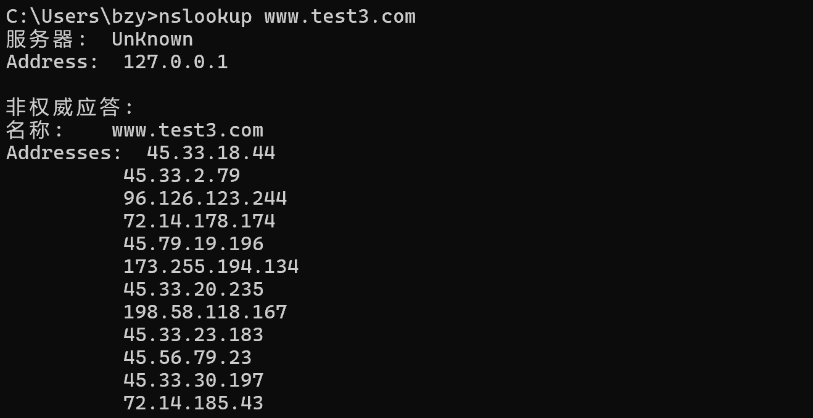

# Lab1 - DNS relay

> PB22081571 薄震宇

## 实验目的

本次实验旨在实验一个DNS中继器，处理本机发出的DNS请求，根据本地的配置文件决定如何处理（拦截，本地解析或中继）。

## 实验内容

本次实验只需要补全框架中代码即可，具体来说，需要补全`query_part`类的`unpack`方法和`pack`方法，`message`类的`r_pack`方法，`realy_server`类的`process`方法。下面分别对这几个类中补全的几处代码进行解释。

### query_part

`query_part`表示问题记录，`unpack`方法用于从记录中解析出二进制查询报文的问题节，`pack`方法用于将问题节打包回二进制查询报文。问题节的格式如下图：


#### unpack

`unpack`方法用于解析二进制查询报文中的问题节，也即解析出域名，查询类型和查询类别。此外我在框架的基础上添加了一个成员变量`original_name`，用于表示问题节中的域名段，这可以方便后续的打包操作。

要查询的域名会被编码为一些labels序列，每个labels包含一个字节表示后续字符串长度，以及这个字符串，以0长度和空字符串来表示域名结束。这个字段可能为奇数字节，不需要进行边界填充对齐。

所以解析域名时可以使用一个循环，首先读取后续字符串长度，然后再在这个长度范围内读取字符串。读取完成后进行一个判断：如果字符串长度为0则结束循环，否则在读取完字符串后添加`.`到域名中。

假设`data[idx] == 0`，则`data[0:idx+1]`是`labels`段，所以将`data[0:idx+1]`赋值给`original_name`即可。

因为查询类型和查询类别紧跟在域名段后且均占两个字节，所以可以直接使用`struct.unpack('>HH', data[idx + 1: idx + 5])`来读取。

`unpack`方法的代码如下：

```python
def unpack(self, data):
        """
        TODO: 解析二进制查询报文中的问题节，data -> name, type, class
        """
        self.name = ""
        idx = 0
        # 先处理域名
        while True:
            for i in range(idx + 1, idx + 1 + data[idx]):
                # data[idx]表示后续字符串长度（以点分隔）
                self.name += chr(data[i])
            idx += data[idx] + 1
            if data[idx] == 0:
                break
            self.name += '.'
        self.original_name = data[0:idx+1]  # 获得原始域名段
        self.type, self.classify = struct.unpack('>HH', data[idx + 1: idx + 5])
```

#### pack

`pack`方法用于将问题节打包回二进制查询报文，只需要将`self.original_name`，`self.type`和`self.classify`这三个数据成员依次写入二进制报文`data`中并返回即可。

我首先初始化了一个`bytearray`对象`data`来存储返回值，然后使用`extend`方法将`original_name`添加到`data`中，因为查询类型和查询类别紧跟在域名段后且均占两个字节，所以可以直接使用`struct.pack('>HH', self.type, self.classify)`将这两个字段添加到报文中。

`pack`的代码如下：

```python
def pack(self):
        """
        打包回二进制
        TODO: 将问题节打包回二进制查询报文，name, type, class -> data
        """
        data = bytearray()
        data.extend(self.original_name)
        data += struct.pack('>HH', self.type, self.classify)
        return data
```

### message

`message`类表示查询报文，`r_pack`方法用于根据ip资源和当前查询报文内容生成回复报文。

DNS报文的格式如下：


其中`Identification`，`Questions`，`Authority RRs`，`Additional RRs`等字段都保持与查询报文相同即可。

`Authority RRs`直接设为1即可。

头部标志字段的定义如下：


在本地域名解析器构造的回复报文中，`QR = 1`，`Opcode = 0`，`AA = 0`，`TC = 0`，`RD = 1`，`RA = 1`，`Z = 0`，请求域名为`0.0.0.0`时，`rcode = 3`，否则`rcode = 1`。所以可以得到`flags`的设置应如下：

```python
flags = 0x8183 if ip == '0.0.0.0' else 0x8180
```

此时，可以将头部和问题节打包添加至回复报文中。然后需要设置答复节。

答复节报文格式如下：


其中域名段用指针指向问题节的域名以减小报文。因为问题节报文前面有12个字节的头部内容，并且用指针指向域名时要求前两位为1，所以指针应为`0xc00c`。查询类型和查询类别字段与问题节保持一致即可。然后再设置`TTL = 200`和`Rdatalength = 4`。最后将答复节的内容依次打包添加至回复报文中再返回回复报文即可。

`r_pack`的代码如下：

```python
def r_pack(self, ip):
        """
        TODO: 根据ip资源和当前查询报文内容生成回复报文，注意哪些头部字段要修改
        """
        # 头部
        data = struct.pack('>H', self.id)
        # flags = self.flags | 0x8083 if ip == '0.0.0.0' else self.flags | 0x8081
        flags = 0x8183 if ip == '0.0.0.0' else 0x8180
        data += struct.pack('>HHHHH', flags, self.quests, 1, self.author, self.addition)
        # 问题节
        data += self.query.pack()
        # 答复节
        name = 0xc00c  # 指针，指向问题节的域名段
        ttl = 200  # 生存时间
        length = 4  # 数据长度
        data += struct.pack('>HHHLH', name, self.query.type, self.query.classify, ttl, length)
        ips = ip.split('.')
        data += struct.pack('BBBB', int(ips[0]), int(ips[1]), int(ips[2]), int(ips[3]))
        return data
```

### relay_server

`relay_server`表示中继器，用于接收并处理DNS报文，`process`方法用于处理报文。

在开始处理前首先使用`time`方法获取当前时间以用于后面计算处理时长，然后实例化一个`message`的对象`m`用于答复。

如果`m.qr == 0`，则说明接收的报文是查询报文。

* 如果`m.id`在配置文件中，则先提取出查询域名对应的`ip`，然后调用`m`的`r_pack`方法生成回复报文，发送给请求方，并且记录处理时间，然后打印相关信息。如果`ip == 0.0.0.0`，那么会进行拦截，此时需要打印处理方式为`intercept`，否则打印处理方式为`local resolve`，此外还有其他信息需要打印，详见后面的代码。

* 如果`m.id`不在配置文件中，则先存储查询域名，请求方地址和开始时间在`self.transaction[m.id]`中以供后续使用。然后将查询报文转发给公共DNS服务器。

如果`m.qr != 0`，则说明接收的报文是回复报文。首先从`self.transaction[m.id]`中提取出域名，请求方地址，和处理开始时间，然后将回复报文转发给请求方，计算处理时间，最后再打印相关信息。

`process`方法的代码如下：

```python
def process(self, data, addr):
        """报文处理"""
        start_time = time()
        m = message(data)
        # TODO: 解析收到的报文，生成回复返回给请求方
        # 如果是查询报文，检查是否在配置文件中，若在则返回配置文件中的ip，否则转发给公共DNS服务器
        if m.qr == 0:
            # 是查询报文
            name = m.query.name
            if name in self.config:
                # 在配置文件中
                ip = self.config[name]
                ans = m.r_pack(ip)
                self.s.sendto(ans, addr)
                res_time = time() - start_time
                if ip == '0.0.0.0':
                    print(f'query to {name}, handled as intercepted, takes {res_time:.4f}s')
                else:
                    print(f'query to {name}, handled as local resolve, takes {res_time:.4f}s')
            else:
                # 不在配置文件中，中继
                self.transaction[m.id] = (name, addr, start_time)  # 存储域名，请求端地址，开始时间
                self.s.sendto(data, self.nameserver)  # 转发给公共DNS服务器
        else:
            # 是回复报文
            if m.id in self.transaction:
                name, destination, start_time = self.transaction[m.id]
                del self.transaction[m.id]
                self.s.sendto(data, destination)
                res_time = time() - start_time
                print(f'query to {name}, handled as relay, takes {res_time:.4f}s')
```

## 实验结果

### nslookup测试

test1：

nslookup结果如下：


程序输出如下：


test2：

nslookup结果如下：


程序输出如下：


test3：

nslookup结果如下：



程序输出如下：


### 浏览器测试

正常访问知乎`www.zhihu.com`时，会出现下面的图片：


运行中继器后，再访问知乎，上面的图片不再出现，如下图：


程序输出中与访问图片相关的内容如下：


以上结果均符合预期。
