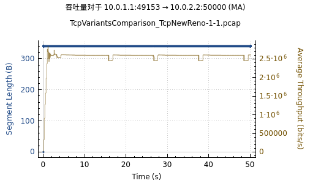
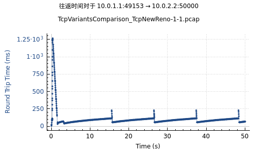
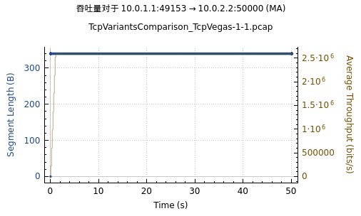
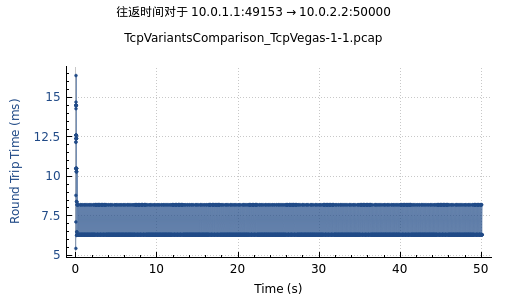
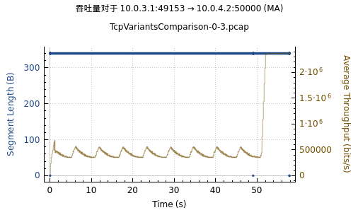
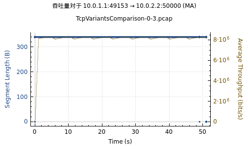

# Lab2 ns3

> PB22081571 薄震宇

## 代码框架解释

`tcp-variants-comparsion`是一个使用 ns-3 网络模拟器进行 TCP 变体比较的示例。

首先代码定义了多个全局变量和回调函数用于跟踪和记录 TCP 连接的各种性能指标，如拥塞窗口、慢启动阈值、RTT、RTO 等。

然后在`main`函数中构建网络。首先函数定义了一些参数如下：

```cpp
std::string transport_prot = "TcpWestwood"; // 传输协议  
double error_p = 0.0; // 错误率
std::string bandwidth = "2Mbps"; // 瓶颈带宽
std::string delay = "0.01ms"; // 瓶颈延迟
std::string access_bandwidth = "10Mbps"; // 接入带宽
std::string access_delay = "45ms"; // 接入延迟
bool tracing = false; // 是否追踪
std::string prefix_file_name = "TcpVariantsComparison";
uint64_t data_mbytes = 0; // 数据量, 单位MB
uint32_t mtu_bytes = 400; // IP包大小
uint16_t num_flows = 1; // 流数
double duration = 100.0; // 持续时间
uint32_t run = 0;
bool flow_monitor = false; // 流监控
// bool pcap = false; // 是否使用pcap
bool pcap = false; // 是否启用pcap抓包
bool sack = true; // 是否使用SACK
std::string queue_disc_type = "ns3::PfifoFastQueueDisc"; // 队列类型
std::string recovery = "ns3::TcpClassicRecovery"; // 恢复算法, 默认为经典恢复算法
```

然后再解析命令行参数，将用户在命令行中提供的值赋给相应的变量。然后令`transport_prot = std::string ("ns3::") + transport_prot;`以确保传输协议名称与 ns-3 网络模拟器中的命名空间一致。

然后设置随机数生成器的运行索引并启动模拟器。

然后函数计算报文中应用程序数据的有效负载的大小ADU，`tcp_adu_size = mtu_bytes - 20 - (ip_header + tcp_header)`

然后再设置仿真的开始时间，并根据开始时间和持续时间计算结束时间。

然后使用使用 `Config::SetDefault` 方法为 ns-3 模拟器中的 TCP 配置参数设置默认值：设置 TCP 套接字的接收和发送缓冲区大小为 2 MB，根据`sack`设置是否使用 SACK 机制，设置 TCP 协议的恢复算法类型等。

然后根据`transport_prot`选择TCP变体，需要注意的是`TcpWestwoodPlus`不是一个`TypeId`，需要使用`TcpWestWood`来代替。

然后函数通过下面的代码创建源节点，网关节点和接收节点三类节点，源节点和接收节点的数量为`num_flows`，网关节点的数量为1：

```cpp
// Create gateways, sources, and sinks
NodeContainer gateways;
gateways.Create (1);
NodeContainer sources;
sources.Create (num_flows);
NodeContainer sinks;
sinks.Create (num_flows);
```

然后再通过下面的代码配置错误模型，用于模拟丢包，错误率为`error_p`：

```cpp
Ptr<UniformRandomVariable> uv = CreateObject<UniformRandomVariable> ();
uv->SetStream (50);
RateErrorModel error_model;
error_model.SetRandomVariable (uv);
error_model.SetUnit (RateErrorModel::ERROR_UNIT_PACKET);
error_model.SetRate (error_p);
```

然后通过下面的代码配置瓶颈链路的带宽，延迟和错误模型：

```cpp
PointToPointHelper UnReLink;
UnReLink.SetDeviceAttribute ("DataRate", StringValue (bandwidth));
UnReLink.SetChannelAttribute ("Delay", StringValue (delay));
UnReLink.SetDeviceAttribute ("ReceiveErrorModel", PointerValue (&error_model));
```

然后安装网络协议栈，配置流量控制队列，设置 IP 地址分配的基础网络地址和子网掩码：

```cpp
InternetStackHelper stack;
stack.InstallAll ();
TrafficControlHelper tchPfifo;
tchPfifo.SetRootQueueDisc ("ns3::PfifoFastQueueDisc");
TrafficControlHelper tchCoDel;
tchCoDel.SetRootQueueDisc ("ns3::CoDelQueueDisc");
Ipv4AddressHelper address;
address.SetBase ("10.0.0.0", "255.255.255.0");
```

然后配置接入链路的带宽和延迟：

```python
PointToPointHelper LocalLink;
LocalLink.SetDeviceAttribute ("DataRate", StringValue (access_bandwidth));
LocalLink.SetChannelAttribute ("Delay", StringValue (access_delay));
```

然后计算队列的最大大小，设置`PfifoFastQueueDisc` 和 `CoDelQueueDisc` 队列调度器的最大大小：

```python
DataRate access_b (access_bandwidth);
DataRate bottle_b (bandwidth);
Time access_d (access_delay);
Time bottle_d (delay);
uint32_t size = static_cast<uint32_t>((std::min (access_b, bottle_b).GetBitRate () / 8) *
((access_d + bottle_d) * 2).GetSeconds ());
Config::SetDefault ("ns3::PfifoFastQueueDisc::MaxSize",
                  QueueSizeValue (QueueSize (QueueSizeUnit::PACKETS, size / mtu_bytes)));
Config::SetDefault ("ns3::CoDelQueueDisc::MaxSize",
                  QueueSizeValue (QueueSize (QueueSizeUnit::BYTES, size)));
```

然后使用循环为每个流配置网络设备、链路和队列调度器。循环中首先在源节点和网关节点之间安装点对点链路，在安装的设备上配置 `PfifoFastQueueDisc` 队列调度器，再为设备为设备分配 IP 地址；然后再在网关节点和接收节点之间安装点对点链路，根据`queue_disc_type`的值，选择合适的队列调度器并安装，再为设备分配 IP 地址，最后将接收节点的接口添加到 sink_interfaces容器中：

```python
for (uint32_t i = 0; i < num_flows; i++)
{
  NetDeviceContainer devices;
  devices = LocalLink.Install (sources.Get (i), gateways.Get (0));
  tchPfifo.Install (devices);
  address.NewNetwork ();
  Ipv4InterfaceContainer interfaces = address.Assign (devices);

  devices = UnReLink.Install (gateways.Get (0), sinks.Get (i));
  if (queue_disc_type.compare ("ns3::PfifoFastQueueDisc") == 0)
    {
      tchPfifo.Install (devices);
    }
  else if (queue_disc_type.compare ("ns3::CoDelQueueDisc") == 0)
    {
      tchCoDel.Install (devices);
    }
  else
    {
      NS_FATAL_ERROR ("Queue not recognized. Allowed values are ns3::CoDelQueueDisc or ns3::PfifoFastQueueDisc");
    }
  address.NewNetwork ();
  interfaces = address.Assign (devices);
  sink_interfaces.Add (interfaces.Get (1));
}
```

然后启用全局路由，使得网络上的每个节点都使用最短路径转发数据包：

```python
Ipv4GlobalRoutingHelper::PopulateRoutingTables ();
```

然后在配置源和接收端的应用关系，并将其安装到源节点和接收节点上。

首先定义端口号为5000，获取一个可用的IP v4地址绑定到该端口上。对于每一个源节点，设置其发送 TCP 套接字的段大小为`tcp_adu_size`，再创建一个`BulkSendHelper`的对象`ftp`，设置其远程地址为接收端节点的地址，发送数据的大小为`tcp_adu_size`，最大发送字节数为`data_mbytes * 1000000`。然后将`ftp`安装到当前的源节点上，并设置发送数据的启动和停止时间，然后再设置接收端应用程序的协议类型为 TCP，并将`ftp`安装到相应的接收节点上，设置接收数据的启动和停止时间：

```python
for (uint16_t i = 0; i < sources.GetN (); i++)
{
  AddressValue remoteAddress (InetSocketAddress (sink_interfaces.GetAddress (i, 0), port));
  Config::SetDefault ("ns3::TcpSocket::SegmentSize", UintegerValue (tcp_adu_size));
  BulkSendHelper ftp ("ns3::TcpSocketFactory", Address ());
  ftp.SetAttribute ("Remote", remoteAddress);
  ftp.SetAttribute ("SendSize", UintegerValue (tcp_adu_size));
  ftp.SetAttribute ("MaxBytes", UintegerValue (data_mbytes * 1000000));

  ApplicationContainer sourceApp = ftp.Install (sources.Get (i));
  sourceApp.Start (Seconds (start_time * i));
  sourceApp.Stop (Seconds (stop_time - 3));

  sinkHelper.SetAttribute ("Protocol", TypeIdValue (TcpSocketFactory::GetTypeId ()));
  ApplicationContainer sinkApp = sinkHelper.Install (sinks.Get (i));
  sinkApp.Start (Seconds (start_time * i));
  sinkApp.Stop (Seconds (stop_time));
}
```

然后，根据控制变量`tracing`，`pacp`，`flow_monitor`等的真假决定是否要启用追踪功能，PCAP抓包功能和流监控功能：

```python
// Set up tracing if enabled
if (tracing)
{
  std::ofstream ascii;
  Ptr<OutputStreamWrapper> ascii_wrap;
  ascii.open ((prefix_file_name + "-ascii").c_str ());
  ascii_wrap = new OutputStreamWrapper ((prefix_file_name + "-ascii").c_str (),
                                        std::ios::out);
  stack.EnableAsciiIpv4All (ascii_wrap);

  Simulator::Schedule (Seconds (0.00001), &TraceCwnd, prefix_file_name + "-cwnd.data");
  Simulator::Schedule (Seconds (0.00001), &TraceSsThresh, prefix_file_name + "-ssth.data");
  Simulator::Schedule (Seconds (0.00001), &TraceRtt, prefix_file_name + "-rtt.data");
  Simulator::Schedule (Seconds (0.00001), &TraceRto, prefix_file_name + "-rto.data");
  Simulator::Schedule (Seconds (0.00001), &TraceNextTx, prefix_file_name + "-next-tx.data");
  Simulator::Schedule (Seconds (0.00001), &TraceInFlight, prefix_file_name + "-inflight.data");
  Simulator::Schedule (Seconds (0.1), &TraceNextRx, prefix_file_name + "-next-rx.data");
}

if (pcap)
{
  UnReLink.EnablePcapAll (prefix_file_name, true);
  LocalLink.EnablePcapAll (prefix_file_name, true);
}

// Flow monitor
FlowMonitorHelper flowHelper;
if (flow_monitor)
{
  flowHelper.InstallAll ();
}

Simulator::Stop (Seconds (stop_time));
Simulator::Run ();

if (flow_monitor)
{
  flowHelper.SerializeToXmlFile (prefix_file_name + ".flowmonitor", true, true);
}
```

最后使用`Simulator::Destroy()`清理和释放模拟器在运行过程中分配的所有资源，然后返回 0。

## assignment1

### 参数设置

assignment1 只需要修改一些参数以使链路情况满足给出的图片即可：

首先需要修改使用的传输协议`transport_prot`。因为需要比较`TcpNewReno`和`TcpVegas`两种拥塞控制算法，所以我设置了一个控制变量`is_newreno`来标志使用哪种算法，`is_newreno`为真时使用`TcpNewReno`，为假时使用`TcpVegas`。

此外还需要修改接入链路和瓶颈链路的带宽和延迟为图中参数。接入链路的带宽和延迟分别是`access_bandwith`和`access_delay`，应分别设为`15Mbps`和`1ms`；瓶颈链路的带宽和延迟分别是`bandwidth`和`delay`，应分别设为`3Mbps`和`1ms`。

还需要修改持续时间`duration`为50s。

还需要修改`pcap`为`true`以启用PCAP抓包。

为了使对比更明显，我还关闭了sack（令`sack = false`）。

最后为了区分使用不同拥塞控制算法生成的文件，我还修改了文件名前缀`prefix_file_name`，令

```cpp
prefix_file_name = "TcpVariantsComparison_" + transport_prot;
```

以上对于参数的修改的代码如下：

```cpp
// 修改配置
// 修改传输协议
bool is_newreno = false; // 标志使用TcpNewReno还是TcpVegas
transport_prot = is_newreno ? "TcpNewReno" : "TcpVegas";
// 修改接入链路和瓶颈链路的带宽和延迟
bandwidth = "3Mbps";
delay = "1ms";
access_bandwidth = "15Mbps";
access_delay = "1ms";
// 这里在输出文件前缀加上传输协议，以区分使用不同拥塞控制算法生成的文件
prefix_file_name = "TcpVariantsComparison_" + transport_prot; // 输出文件前缀
// 设置持续时间为50s
duration = 50.0;
// 启用pcap抓包
pcap = true;
// 关闭sack
sacp = false;
```

### 结果展示

#### TcpNewReno

##### 吞吐量



##### RTT



#### TcpVegas

##### 吞吐量



##### RTT



### 结果分析

由图像可得以下几点结论：

1. 单流无干扰情况下，TcpNewReno 的平均吞吐量略低于链路带宽，而 TcpVegas 的平均带宽基本保持在链路带宽水平上。
2. 单流无干扰情况下，TcpNewReno 的平均吞吐量的波动更大，而 TcpVegas 的平均吞吐量几乎无波动。
3. 单流无干扰情况下，TcpNewReno 的 RTT 的峰值显著大于 TcpVegas。
4. 单流无干扰情况下，TcpVegas 的 RTT 趋向于稳定波动，而 TcpNewReno 的 RTT 会慢慢增加，直到遇到大幅度丢包。

**下面根据算法具体的策略来分析出现上述现象的原因：**

我们先分析算法的策略。

1. TcpNewReno

   TcpNewReno 是在 Reno 的基础上对快速恢复算法进行修改，以更好地处理一次拥塞中丢失多个报文的情形。TcpNewReno 使 TCP 终端可以把一次拥塞丢失多个报文的情形与多次拥塞的情形区分开来，进而在每一次拥塞发生后拥塞窗口仅减半一次，从而提高了 TCP 的顽健性和吞吐量。所以只有一个数据包丢失的情况下，其机制和 Reno 是一样的，只有当同时有多个包丢失时才能显示出它的优势。

2. TcpVegas

   * TcpVegas 引入了新的重传机制：当收到重复的 ACK 时，Vegas 检查当前时间和相关段记录的时间戳之间的差值是否大于超时值。如果是，那么 Vegas 不需要等待3个重复的 ACK 就可以重传这个片段。在许多情况下，由于损失太大或窗口太小，发送方将永远不会收到三个重复的 ACK ，因此，Reno 将不得不依赖上面提到的粗粒度超时。当收到一个非重复的 ACK 时，如果它是重传后的第一个或第二个，Vegas 会再次检查自段发送以来的时间间隔是否大于超时值。如果是的话，Vegas 会重传这个片段。这将捕获在重传之前可能丢失的任何其他段，而不必等待重复的 ACK。所以 TcpVegas 可以更及时地重传丢失的分段。
   * TcpVegas 引入了新的拥塞避免机制：Vegas 通过比较实际吞吐量和期望吞吐量来调节拥塞窗口的大小。记$diff = (Expected - Actual)\times BaseRTT$，定义两个阈值$\alpha,\beta$，当$diff < \alpha$时，拥塞窗口减1；当$diff > \beta$时，拥塞窗口加1；其他情况下拥塞窗口不变。
   * TcpVegas 引入了新的慢启动机制：在慢启动过程中增加了拥塞检测。相对来说比 TcpReno 保守了一些，每隔一个 RTT 指数增长一次窗口值。也就是说，每两个 RTT，窗口值翻倍，一个 RTT 是增长，一个 RTT是拥塞检测。如果检测到当前的吞吐量与期望吞吐量之差大于某个阈值$\gamma$ ，那么应该进入线性增长阶段。

根据上面的算法策略我们可以得到，TcpVegas 可以更快地检测到丢包以及时重传丢失的分段，而 TcpNewReno对丢包的检测与 TcpReno 是一样的，也就是说 TcpVegas ”浪费“了更少的时间。因为发生丢包时，拥塞窗口会减小，且超时丢包时拥塞窗口会减为1 MSS，所以丢包的平均吞吐量有很大影响，所以 TcpVegas 的平均吞吐量更大。这说明了第一条结论。

此外，TcpVegas 对于拥塞避免的实现更为”谨慎“，在拥塞避免阶段会根据实际吞吐量和期望吞吐量的差值不断地上下调整拥塞窗口，这使 TcpVegas 能够预测拥塞并提前作出调整，此外 TcpVegas 在慢启动过程中也加入了拥塞检测。而 TcpNewReno 主要是在拥塞后的恢复做了改进，在拥塞避免方面与 TcpReno 是一样的，所以 TcpVegas的平均吞吐量和 RTT 的波动都更小。TcpVegas 的 RTT 趋向于稳定波动，而 TcpNewReno 的 RTT 会慢慢增加，直到遇到大幅度丢包。这说明了第二条和第四条结论。

因为 TcpVegas 在慢启动和拥塞避免状态中都使用了更为谨慎的策略，并且使 RTT 保持在很小的波动范围，而TcpNewReno 的 RTT 会慢慢增加，直到遇到大幅度丢包，这导致它的 RTT 可以达到很大的峰值。所以TcpNewReno 的 RTT 峰值大于 TcpVegas。这说明了第三条结论。

**所以我们可以总结得到两个算法的区别如下：**

1. TcpNewReno 的拥塞窗口在慢启动阶段指数增长，拥塞避免阶段线性增长。TcpVegas 的拥塞窗口在慢启动阶段指数增长，但是是每过两个 RTT 翻倍，拥塞避免状态根据实际吞吐量和期望吞吐量的差值动态上下调整拥塞窗口以避免拥塞。总体来说 TcpVegas 拥塞窗口增长得更慢，调节更精细，更有效地避免了拥塞。
2. TcpNewReno 的 RTT 峰值较大且波动显著，这是因为拥塞窗口迅速增长可能导致网络拥塞，导致队列积压和 RTT 增加。又因为拥塞信号依赖丢包，TcpNewReno 往往在链路已经非常拥塞时才会减小窗口，造成更高的 RTT。而 TcpVegas 的 RTT 峰值较小且稳定，这是因为 TcpVegas 通过延迟变化感知链路负载，动态调整窗口以防止拥塞发生，会在检测到 RTT 增大时提前减小窗口，避免队列积压和严重拥塞，从而使 RTT 更加平稳且较低。

最终的结果是单流无干扰情况下，TcpVegas 在拥塞避免方面的实现优于 TcpNewReno ，波动更小，并且TcpVegas可以保持较小的 RTT 和更大的平均吞吐量（多流竞争时则不一定）。

## assignment2

### 参数设置

首先仍然需要修改一些基本参数：

因为assignment2 同时使用了两种拥塞控制算法，所以不能再只使用`transport_prot`来表示协议，这里使用`transport_prot_0`和`transport_prot_1`分别表示两种协议。

因为此时链路仍然有两种情况：带宽为`20Mbps`，延迟为`1ms`和带宽为`10Mbps`，延迟为`1ms`，所以这里仍然使用框架中的`UnReLink`和`LocalLink`，修改`access_bandwidth`，`access_delay`，`bandwidth`，`delay`为`20Mbps`，`1ms`，`10Mbps`，`1ms`。

此外修改`pcap`为`true`以启用PCAP抓包，`sack`为`false`以使对比更明显。

因为此时瓶颈链路上有2个TCP流，所以修改`num_flows`为2。

以上对于参数的修改的代码如下：

```cpp
// 修改配置
std::string transport_prot_0 = "TcpNewReno";
std::string transport_prot_1 = "TcpVegas";
bandwidth = "10Mbps";
delay = "1ms";
access_bandwidth = "20Mbps";
access_delay = "1ms";
pcap = true;
sack = false;
num_flows = 2;
```

在创建Node对象时，需要创建两个网关节点，分别对应图中的`Node2`和`Node3`，也就是下面的这两行代码：

```cpp
NodeContainer gateways;
gateways.Create (2);
```

在创建好节点，安装好协议栈后，再分别设置两个发送节点的拥塞控制算法，通过下面的这段代码实现：

```cpp
// 设置发送节点的拥塞控制算法
TypeId tcpTid;
NS_ABORT_MSG_UNLESS (TypeId::LookupByNameFailSafe (transport_prot_0, &tcpTid), "TypeId " << transport_prot_0 << " not found");
Config::Set ("/NodeList/"+ std::to_string(sources.Get(0)->GetId()) +"/$ns3::TcpL4Protocol/SocketType", TypeIdValue (TcpNewReno::GetTypeId ()));
NS_ABORT_MSG_UNLESS (TypeId::LookupByNameFailSafe (transport_prot_1, &tcpTid), "TypeId " << transport_prot_1 << " not found");
Config::Set ("/NodeList/"+ std::to_string(sources.Get(1)->GetId()) +"/$ns3::TcpL4Protocol/SocketType", TypeIdValue (TcpVegas::GetTypeId ()));
```

也就是通过`GetId()`方法得到节点id进而得到配置路径，通过`Config::Set`可以设置需要的拥塞控制算法。

在连接节点时，因为我们现在有发送节点，网关节点，接收节点均有1个，所以也需要修改原有代码。原有代码只有一个网关节点，一组源节点和接收节点通过这个网关节点相连，而现在则需要将源节点连接到第一个网关节点，再将第二个网关节点连接到接收节点。此外还需要连接两个网关节点。源节点与网关节点之间的链路用`LocalLink`设置，网关节点之间和网关节点与接收节点之间的链路用`UnReLink`设置。代码如下：

```cpp
for (uint32_t i = 0; i < num_flows; i++)
    {
      NetDeviceContainer devices;
      // 源节点到第一个网关节点
      devices = LocalLink.Install (sources.Get (i), gateways.Get (0));
      tchPfifo.Install (devices);
      address.NewNetwork ();
      Ipv4InterfaceContainer interfaces = address.Assign (devices);
      // 第二个网关节点到接收节点
      devices = UnReLink.Install (gateways.Get (1), sinks.Get (i));
      if (queue_disc_type.compare ("ns3::PfifoFastQueueDisc") == 0) {
          tchPfifo.Install (devices);
      } else if (queue_disc_type.compare ("ns3::CoDelQueueDisc") == 0) {
          tchCoDel.Install (devices);
      } else {
          NS_FATAL_ERROR ("Queue not recognized. Allowed values are ns3::CoDelQueueDisc or ns3::PfifoFastQueueDisc");
      }
      address.NewNetwork ();
      interfaces = address.Assign (devices);
      sink_interfaces.Add (interfaces.Get (1));
    }
  
  // 第一个网关节点到第二个网关节点
  NetDeviceContainer devices;
  devices = UnReLink.Install (gateways.Get (0), gateways.Get (1));
  address.NewNetwork();
  Ipv4InterfaceContainer interfaces = address.Assign (devices);
```

对于安装的`BulkSendApplication`，我们需要修改发送方应用程序的启动和停止时间分别为1s和50s，接收方应用程序的启动和停止时间分别为0s和50s。代码如下：

```cpp
for (uint16_t i = 0; i < sources.GetN (); i++)
{
  AddressValue remoteAddress (InetSocketAddress (sink_interfaces.GetAddress (i, 0), port));
  Config::SetDefault ("ns3::TcpSocket::SegmentSize", UintegerValue (tcp_adu_size));
  BulkSendHelper ftp ("ns3::TcpSocketFactory", Address ());
  ftp.SetAttribute ("Remote", remoteAddress);
  ftp.SetAttribute ("SendSize", UintegerValue (tcp_adu_size));
  ftp.SetAttribute ("MaxBytes", UintegerValue (data_mbytes * 1000000));

  ApplicationContainer sourceApp = ftp.Install (sources.Get (i));
  sourceApp.Start (Seconds (1.0));
  sourceApp.Stop (Seconds (50.0));

  sinkHelper.SetAttribute ("Protocol", TypeIdValue (TcpSocketFactory::GetTypeId ()));
  ApplicationContainer sinkApp = sinkHelper.Install (sinks.Get (i));
  sinkApp.Start (Seconds (0.0));
  sinkApp.Stop (Seconds (50.0));
}
```

### 结果展示

瓶颈链路是`Node2 ---- Node3`。

观察`Node2`上的两个流的平均吞吐量可得带宽的分配情况，两个拥塞控制算法对应的Tcp流的平均吞吐量如下：

**TcpNewReno：**


**TcpVegas：**



### 结果分析

观察图像可得，在两个拥塞控制算法共存时，TcpNewReno的竞争能力更强，可以占用更高的带宽。下面分析原因：

在 assignment1 的分析中，我们已经提到，在慢启动和拥塞避免状态中，TcpVegas 都使用更加谨慎的策略以避免丢包。TcpVegas 在检测到轻微延迟增加时就开始减小窗口，也就是说其优先保证链路稳定性，而非争夺更大的带宽，这会导致其在带宽竞争中落于下风。

而 TcpNewReno 的慢启动和拥塞避免策略与Reno相同，慢启动阶段指数增长窗口，拥塞避免阶段线性增长窗口，直到发生超时丢包时 TcpNewReno 的拥塞窗口才会显著减小至1 MSS。这使得 TcpNewReno 能够快速增长窗口抢占更多的带宽。

因此在两个拥塞控制算法共存时，TcpNewReno 的拥塞窗口增长速度更快，能够更快地抢占可用带宽，竞争能力更强，主要依赖的策略有：

1. 慢启动阶段指数增长窗口（每过一个RTT拥塞窗口翻倍，而 TcpVegas 是每过两个 RTT 拥塞窗口翻倍）。
2. 拥塞避免阶段线性增长拥塞窗口（TcpVegas 在拥塞避免阶段的拥塞窗口会上下变化）。
3. 通过3个重复ACK检测到丢包时不会立即将拥塞窗口减为1 MSS，而是进入快速恢复阶段，此时拥塞窗口变为原来的一半加3 MSS，这使得 TcpNewReno 可以依然保持较大的拥塞窗口而不会显著减小到1 MSS。即使发生超时丢包导致拥塞窗口减小到1 MSS，TcpNewReno 慢启动阶段的指数级增长也可以使其迅速恢复。
4. 此外，TcpNewReno 和 TcpVegas 共存时，TcpVegas 对拥塞更为敏感，当其预测会发生拥塞时，会主动收敛以避免拥塞，而其退让出去的部分带宽会被 TcpNewReno 迅速占据。

总的来说，主要是 TcpNewReno 的拥塞窗口的变化采取了基于丢包的激进增长策略，而 TcpVegas 的拥塞窗口的变化采取了保守的调整策略。